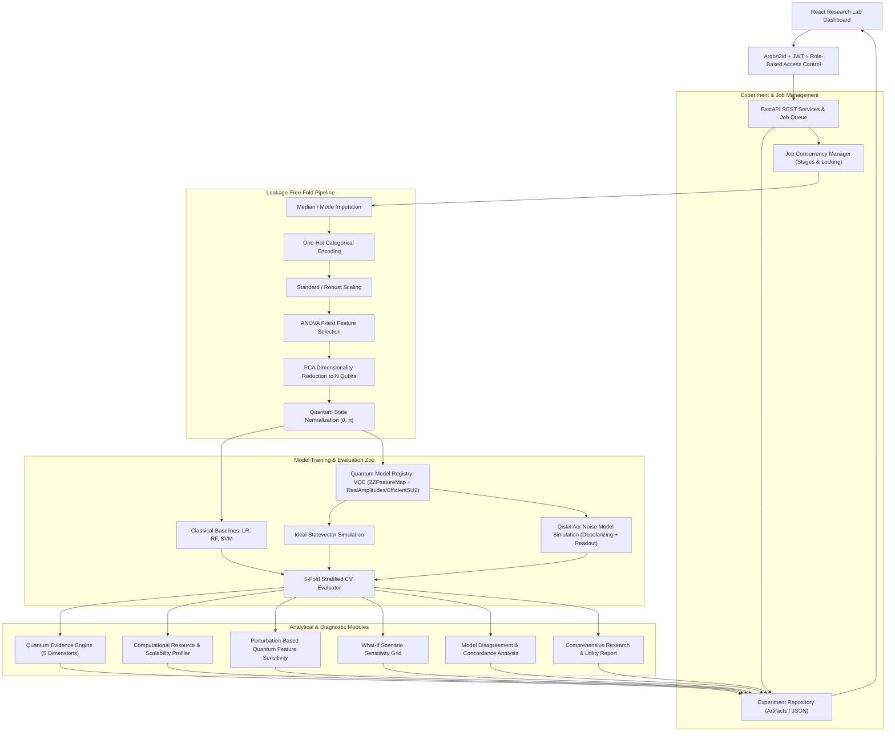

# Q-CARE — HYBRID QUANTUM-CLASSICAL CLINICAL AI PLATFORM

[](https://www.python.org/)
[](https://fastapi.tiangolo.com/)
[](https://www.ibm.com/quantum/qiskit)
[](https://qiskit.org/aer)
[](https://react.dev/)
[](https://www.typescriptlang.org/)
[](LICENSE)

A rigorous, evidence-driven hybrid quantum-classical machine learning platform for biomedical tabular data benchmarking (SIH26139).

---

## 1. Core Research Purpose & Central Philosophy

> **"We do not claim automated medical diagnosis or clinical deployment. We provide a controlled, leakage-free scientific benchmarking platform to measure whether quantum machine learning models offer empirical value over classical algorithms on biomedical tabular data."**

The platform evaluates whether a **Variational Quantum Classifier (VQC)** provides genuine utility compared to strong classical baselines (Logistic Regression, Random Forest, Support Vector Machines) under rigorous, leakage-safe evaluation conditions.

The platform outputs neutral, evidence-based verdicts across 5 dimensions:
- `QUANTUM_PREFERRED`: Quantum model shows statistically significant ROC-AUC advantage and noise robustness.
- `QUANTUM_COMPETITIVE`: Quantum model achieves diagnostic parity with classical baselines.
- `CLASSICAL_PREFERRED`: Classical baselines exceed quantum performance with lower computational cost.
- `INSUFFICIENT_EVIDENCE`: Fold variance or sample size is insufficient to make a scientific recommendation.

---

## 2. Platform Architecture & Data Flow



---

## 3. Phase 2 Capabilities

- **Formal Experiment Registry**: Isolated, file-backed experiment repository preventing cross-session data overwriting and enabling multi-experiment comparison.
- **Job Manager & Concurrency Control**: Explicit multi-stage training lifecycle (`QUEUED`, `PREPROCESSING`, `CLASSICAL_TRAINING`, `QUANTUM_TRAINING`, `CROSS_VALIDATION`, `NOISE_EVALUATION`, `EXPLAINABILITY`, `REPORT_GENERATION`, `COMPLETED`, `FAILED`) with 409 Conflict protection against concurrent runs.
- **Computational Resource & Scalability Profile**: Tracks measured circuit depth, qubit count, parameter count, optimization iterations, simulation latency, and classical runtimes with honest scaling disclosures.
- **Multi-Experiment Empirical Comparison**: Side-by-side comparison of distinct qubit counts, feature maps, ansatz layers, and metrics without subjective ranking bias.
- **Quantum Model Registry Abstraction**: Clean interface defining implemented architectures (`VQC`) and planned research models (`QSVM`, `QNN`, `QuantumKernel`).
- **Strict Role-Based Access Control (RBAC)**: Protected permissions (`dataset:upload`, `model:train`, `prediction:run`, `evidence:view`) with separate `RESEARCHER` and `VIEWER` tiers.
- **Security Hardening**: Dynamic `JWT_SECRET_KEY` configuration, strict CORS origin whitelisting, upload size and format validation, zero hardcoded passwords in client code.
- **Research Diagnostic Suite**: What-If interactive feature perturbations, Model Disagreement matrices, and Quantum Utility Reports.

---

## 4. Technology Stack

- **Backend**: Python 3.11+, FastAPI, Uvicorn, Pydantic v2, Scikit-Learn, Qiskit 1.0+, Qiskit Aer, Argon2-cffi, PyJWT, NumPy, SciPy, Pandas.
- **Frontend**: React 18, TypeScript 5.2, Vite, Vanilla/Tailwind CSS, Lucide Icons.

---

## 5. Getting Started & Configuration

### Run locally with Docker

From the repository root, start both the API and frontend:

```bash
docker compose up --build
```

Open `http://localhost:5173`. The API is available at `http://localhost:8000`, and its interactive documentation is at `http://localhost:8000/docs`. Uploaded files and experiment artifacts are stored in `backend/artifacts` on your computer.

To stop the containers, press `Ctrl+C`, then run `docker compose down`.

### Environment Variables

For local backend development, copy the sample environment file:
```bash
cp backend/.env.example backend/.env
```

Key environment settings in `.env`:
```ini
JWT_SECRET_KEY=local-development-secret
ALLOWED_ORIGINS=["http://localhost:5173","http://127.0.0.1:5173","http://localhost:3000"]
MAX_UPLOAD_SIZE_MB=10
FAST_DEMO_MODE=true
```

### Backend Setup
```bash
cd backend
python -m venv venv
# Windows:
venv\Scripts\activate
# Linux/macOS:
source venv/bin/activate

pip install -r requirements.txt
uvicorn app.main:app --host 0.0.0.0 --port 8000 --reload
```

### Frontend Setup
```bash
cd frontend
npm install
npm run dev
```

Application URL: `http://localhost:5173`
Backend Swagger Docs: `http://localhost:8000/docs`

---

## 6. Running Automated Tests

```bash
cd backend
pytest -v
```

The test suite validates:
- Experiment repository persistence and session isolation
- Job manager stage transitions and duplicate run locks
- RBAC permissions enforcement across roles
- Data upload limits and CSV sanitization
- Leakage-safe 5-fold cross-validation
- VQC optimization and ideal/noisy simulation
- Resource profiling and multi-experiment comparisons

---

## 7. Medical & Research Disclaimer

> **This platform is an experimental research prototype for benchmarking quantum machine learning against classical machine learning algorithms. It is not a clinical diagnostic device, has not undergone regulatory clearance, and must NOT be used for direct patient diagnosis, treatment planning, or clinical decision-making.**

