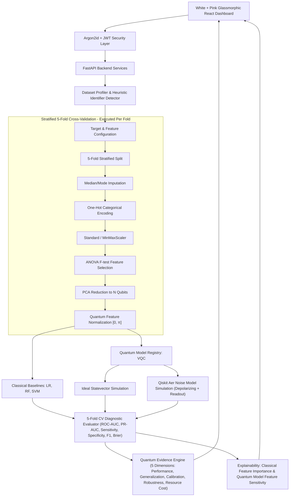

# Q-CARE — HYBRID QUANTUM-CLASSICAL CLINICAL AI PLATFORM

[](https://www.python.org/)
[](https://fastapi.tiangolo.com/)
[](https://www.ibm.com/quantum/qiskit)
[](https://qiskit.org/aer)
[](https://react.dev/)
[](https://www.typescriptlang.org/)
[](LICENSE)

A general-purpose, evidence-driven hybrid quantum-classical machine learning platform for clinical and biomedical tabular data benchmarking.

---

## 1. Core Research Purpose & Central Philosophy

> **"Quantum ko prove nahi karna hai — quantum ki usefulness measure karni hai."**

The platform evaluates whether a **Variational Quantum Classifier (VQC)** provides genuine clinical utility compared to strong classical baselines (Logistic Regression, Random Forest, SVM) under leakage-safe, realistic evaluation conditions.

The platform outputs exactly one evidence-based verdict:
- `QUANTUM_PREFERRED`: Quantum model shows statistically significant ROC-AUC advantage and noise robustness.
- `QUANTUM_COMPETITIVE`: Quantum model achieves diagnostic parity with strong classical baselines.
- `CLASSICAL_PREFERRED`: Classical baselines exceed quantum performance with lower computational cost.
- `INSUFFICIENT_EVIDENCE`: Fold variance or sample size is insufficient to make a scientific recommendation.

---

## 2. Architecture & Data Flow



---

## 3. Key Platform Features

- **Full UCI WDBC Benchmark & Generic CSV Support**: Pre-configured with the full 569-sample, 30-feature UCI Breast Cancer Wisconsin Diagnostic benchmark and supports any compatible tabular biomedical CSV.
- **Leakage-Safe Stratified 5-Fold Cross-Validation**: Imputation, scaling, encoding, feature selection, and PCA dimensionality reduction are fitted strictly inside each cross-validation fold.
- **Ideal vs. Noisy Quantum Simulation**: Compares ideal Qiskit statevector execution against a Qiskit Aer noise model simulating gate depolarizing noise and readout error.
- **Quantum Evidence Engine**: Combines evidence across 5 dimensions (Performance, Generalization, Calibration, Robustness, Resource Cost) to synthesize a transparent verdict.
- **Argon2id & JWT Authentication + RBAC**: Secure password hashing with Argon2id, JWT tokens, and 4 role tiers (`ADMIN`, `RESEARCHER`, `CLINICIAN`, `VIEWER`). Self-registration defaults to `VIEWER`.
- **Quantum Model Feature Sensitivity**: Perturbation-based gradient analysis measuring output probability deltas per quantum feature (not falsely called "Quantum SHAP").
- **Dynamic Patient Inference Lab**: Form fields dynamically adapt to whichever clinical dataset is loaded.
- **Rate Limiting & Audit Logging**: Operational audit trail and endpoint rate throttling for system security.
- **White + Soft Pink Glassmorphism Aesthetic**: Modern clinical research visual design.

---

## 4. Technology Stack & Python Compatibility

- **Python Version**: `3.11.x` (or 3.10+)
- **Backend Stack**: FastAPI, Uvicorn, Pydantic v2, Scikit-Learn, Qiskit 1.0+, Qiskit Aer, Argon2-cffi, PyJWT, NumPy, SciPy, Pandas.
- **Frontend Stack**: React 18, TypeScript, Vite, Tailwind CSS, Lucide Icons.

---

## 5. Quick Start & Setup

### Backend Setup
```bash
cd backend
python -m venv venv
# On Windows:
venv\Scripts\activate
# On Linux/macOS:
source venv/bin/activate

pip install -r requirements.txt
uvicorn app.main:app --host 0.0.0.0 --port 8000 --reload
```

### Frontend Setup
```bash
cd frontend
npm install
npm run dev
```

The application runs at `http://localhost:5173`.
The backend Swagger documentation remains accessible directly at `http://localhost:8000/docs`.

---

## 6. Running Tests

Run the full automated test suite:
```bash
cd backend
pytest -v
```

Tests cover dataset profiling, leakage-free fold preprocessing, classical baselines, VQC SPSA optimization, ideal/noisy simulation, 5-fold CV metric aggregation, Quantum Evidence Engine verdicts, Argon2id security, JWT auth, RBAC permissions, and API endpoints.

---

## 7. Medical Disclaimer

> **This prototype is intended for research, experimentation, and demonstration purposes only. It is not a clinically validated diagnostic system and should not be used as a substitute for professional medical judgment.**
