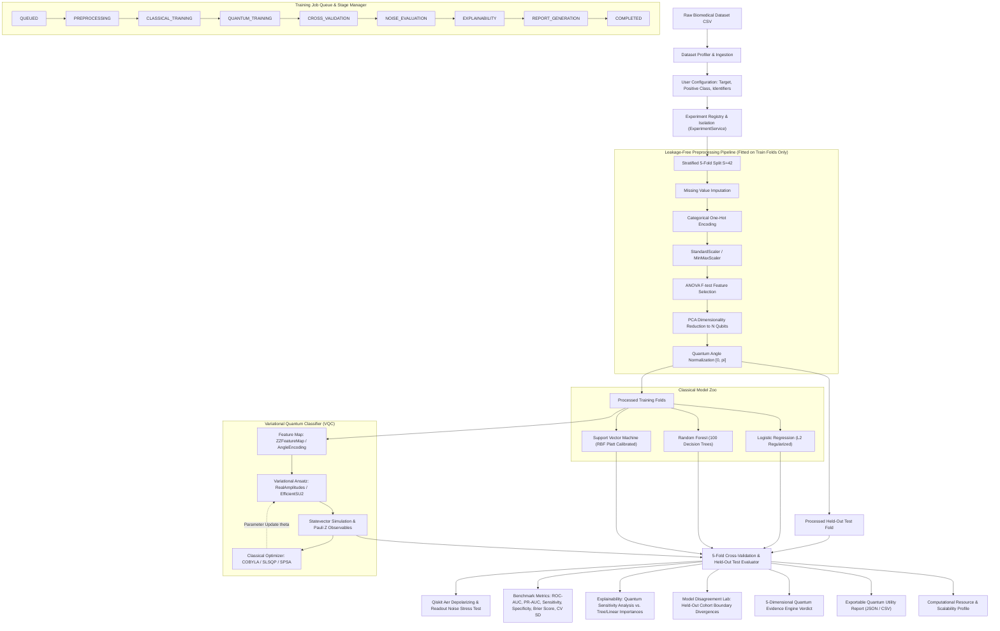

# System Architecture: Q-CARE Research & Benchmarking Platform

## 1. Overview & Research Scope (SIH26139)

The **Q-CARE Platform** (`hybrid-quantum-medical-ai`) provides a dataset-agnostic, scientifically rigorous benchmarking environment for evaluating Parameterized Quantum Circuits (specifically Variational Quantum Classifiers — VQC) against standard classical machine learning baselines (Logistic Regression, Random Forest, Support Vector Machines) on tabular clinical and biomedical datasets.

> **Core Research Philosophy**: "Do not assume quantum is better. Measure, benchmark, record uncertainty."
> This platform is a research benchmarking and evaluation tool, **not** a clinical diagnostic or medical referral product.

---

## 2. Core Architectural Pillars

### 2.1 Experiment Registry & Session Isolation
- Experiments are encapsulated in `ExperimentDetail` entities stored in `backend/artifacts/experiments/{experiment_id}.json`.
- Each experiment maintains isolated configurations, dataset fingerprints, preprocessed matrices, model instances, and benchmark results.
- `ExperimentService` enables researchers to create, switch, delete, and empirically compare multi-experiment runs side-by-side (`/api/experiments/compare`).

### 2.2 Training Job Queue & Concurrency Protection
- Training is managed by `JobManager` with explicit stage progression (`QUEUED` -> `PREPROCESSING` -> `CLASSICAL_TRAINING` -> `QUANTUM_TRAINING` -> `CROSS_VALIDATION` -> `NOISE_EVALUATION` -> `EXPLAINABILITY` -> `REPORT_GENERATION` -> `COMPLETED`).
- Concurrent or duplicate training submissions on an active experiment are prevented with HTTP 409 Conflict protection.

### 2.3 Strict Data Leakage Prevention
- Transformers (`SimpleImputer`, `OneHotEncoder`, `StandardScaler`, `SelectKBest`, `PCA`, and quantum normalizers) are **fitted strictly within training folds**.
- Held-out test folds and single new patient inference requests are transformed using these pre-fitted parameters without refitting.

### 2.4 Real Qiskit Aer Depolarizing Noise Benchmarking
- The platform tests VQC statevectors against actual Qiskit Aer noise models simulating:
  - 1-qubit gate depolarizing error ($1\%$)
  - 2-qubit gate depolarizing error ($3\%$)
  - Readout measurement error ($2\%$)
- If Aer is unavailable in lightweight runtime environments, an analytical mathematical fallback is executed and clearly labeled.

### 2.5 Security, Dynamic Secrets & RBAC
- `JWT_SECRET_KEY` is dynamically loaded from environment variables (or generated securely in dev) rather than hardcoded in source.
- CORS is restricted to configurable origins (`settings.ALLOWED_ORIGINS`).
- Role-Based Access Control (`RESEARCHER`, `VIEWER`) is enforced directly on API endpoints with Bearer tokens.
- No privileged credentials or passwords appear in frontend bundles.

### 2.6 Medical Research Disclaimer
This software is intended strictly for academic and experimental machine learning benchmarking under SIH26139. It is **not** a certified medical device and must **never** be used as the sole basis for clinical diagnosis, treatment planning, or hospital referral workflows.
